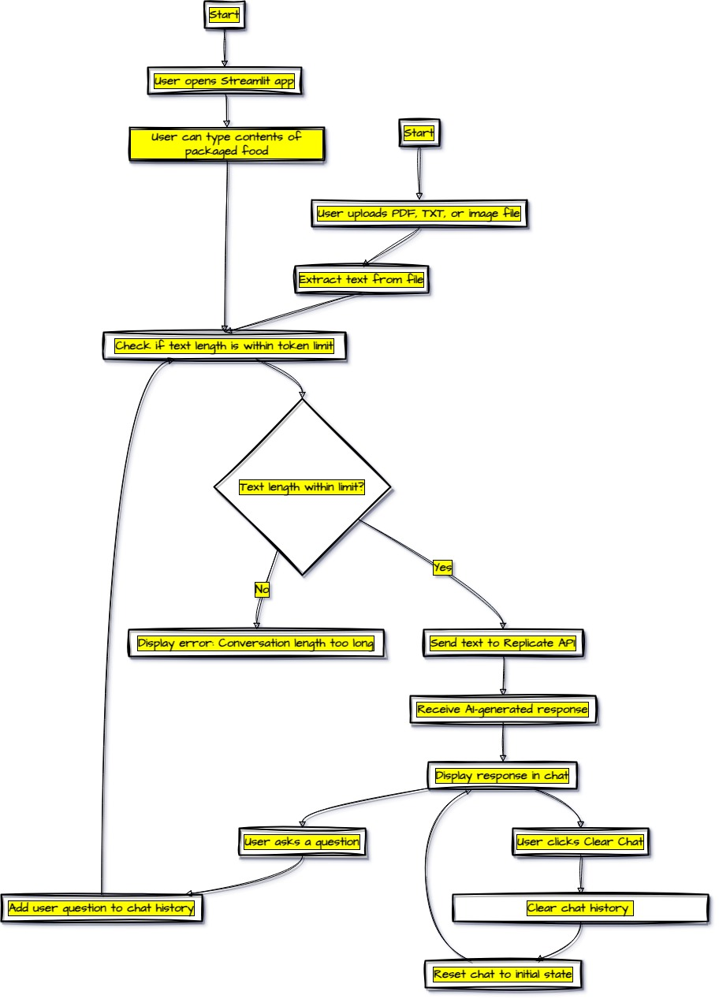

# Snowflake Arctic-Food-Pharmacist Chatbot

**Arctic Food Pharmacist**: "Your AI Food Inspector: Ensuring Safe and Informed Eating"

Introducing Arctic Food Pharmacist, an intelligent food inspector app designed to safeguard your health by analyzing food packaging contents for hazardous and banned ingredients. Simply upload your food labels, and our AI-powered system will inform you about any potential health risks or regulatory issues across different countries.

[Application Link](https://arctic-food-pharmacist.streamlit.app/)


## 💡 Inspiration

The inspiration for this project came from the increasing need for better food safety and regulation compliance. With globalization, food products are crossing borders more frequently, making it essential to ensure that food contents comply with health regulations in various countries. This project aims to leverage AI to assist food inspectors by providing an intelligent tool that can analyze food packaging contents, identify hazardous ingredients, and determine if any contents are banned in specific countries.

## 🎮 What it does 📊 Features

The Snowflake Arctic-Food-Pharmacist Chatbot is a Streamlit-based web application that allows users to interact with an AI-powered chatbot designed to read and understand food packaging contents. The key features include:

- **Chat Interaction**: Users can ask the chatbot about food contents and get informed responses regarding their safety and legality.
- **File Upload**: Users can upload PDF, TXT, or image files containing food packaging contents. The chatbot will extract and analyze the text.
- **Real-Time Analysis**: The chatbot uses AI to determine if any ingredients are hazardous to health or banned in any country.
- **Adjustable Parameters**: Users can adjust model parameters such as temperature and top_p to fine-tune the AI's response.
- **Clear Chat Functionality**: A clear chat button that resets the chat history and deletes the uploaded file.

## ⚙️ How we built it

The Snowflake Arctic-Food-Pharmacist Chatbot was built using the following steps:

1. **Setting Up Streamlit**: Streamlit was chosen for its simplicity and ease of use in building interactive web applications.
2. **Integrating Replicate API**: The Replicate API was used to interact with the Snowflake Arctic model, enabling the chatbot functionality.
3. **File Handling**: Added file upload capabilities to allow users to submit food packaging contents in PDF, TXT, or image formats.
4. **Text Extraction**: Implemented text extraction using PyMuPDF for PDFs and Tesseract OCR for images.
5. **Tokenization**: Used Hugging Face's Transformers library for tokenizing text inputs to ensure they meet model requirements.
6. **Model Parameter Adjustments**: Provided sliders for users to adjust temperature and top_p parameters for the AI model.
7. **UI/UX Enhancements**: Designed a clean and user-friendly interface, including the chat window and control elements.

## ⚔️ Challenges we ran into

Some of the challenges we encountered during development included:

- **Integration Complexity**: Managing the complexity of integrating multiple technologies and ensuring they work seamlessly together.
- **Text Extraction Accuracy**: Optimizing the accuracy of text extraction from various file formats, particularly images with varying quality.
- **Token Limitations**: Ensuring that the text inputs were properly tokenized and within the model's token limits for efficient processing.
- **User Interface Design**: Creating a user-friendly interface that provides a smooth and intuitive user experience.

## 🎉 Accomplishments that we're proud of

We're proud to have successfully developed an end-to-end solution that addresses the critical need for food safety. Key accomplishments include:

- **Effective AI Integration**: Seamlessly integrating AI for real-time analysis of food packaging contents.
- **User-Friendly Design**: Designing an intuitive and accessible interface for users of all technical backgrounds.
- **Robust Text Extraction**: Implementing accurate text extraction from various file formats, enhancing the system's reliability.

## 📚 What we learned

Throughout the development process, we gained valuable insights into:

- **AI Model Deployment**: The intricacies of deploying AI models and integrating them into web applications.
- **Regulatory Knowledge**: Deepening our understanding of food safety regulations and the importance of transparency in the food industry.
- **User-Centric Design**: The importance of designing with the user in mind to create an engaging and effective tool.

## 🚀 What's next for Arctic Food Pharmacist

In the future, we envision expanding Arctic Food Pharmacist with additional features such as:

- **Real-Time Ingredient Analysis**: Enhancing the capability for real-time analysis and alerts for hazardous ingredients.
- **Personalized Dietary Recommendations**: Providing users with tailored dietary advice based on their specific health needs and preferences.
- **Integration with Food Safety Databases**: Linking with global food safety databases for more comprehensive analysis and updates.
- **Enhanced Accuracy and Scalability**: Improving the accuracy of the AI model and scaling the system to accommodate a larger user base.

## Tech Stack

The project leverages the following technologies:

- **Streamlit**: For building the web application interface.
- **Replicate API**: To interact with the Snowflake Arctic AI model.
- **Transformers (Hugging Face)**: For tokenization and text processing.
- **PyMuPDF**: For extracting text from PDF files.
- **Pillow & Tesseract OCR**: For extracting text from image files.
- **Python**: The primary programming language used for backend logic.

## 🚀 Getting Started

To run this project locally, follow these steps:

1. **Clone the repository**:
    ```sh
    git clone https://github.com/mahanteshimath/arctic-food-pharmacist.git
    cd arctic-food-pharmacist
    ```

2. **Install the required packages**:
    ```sh
    pip install streamlit replicate transformers pymupdf pillow pytesseract
    ```

3. **Set up environment variables**:
    - Create a `.streamlit/secrets.toml` file and add your Replicate API token:
    ```toml
    [secrets]
    REPLICATE_API_TOKEN = "your_replicate_api_token_here"
    ```

4. **Run the Streamlit app**:
    ```sh
    streamlit run app.py
    ```

5. **Open your browser**:
    - Navigate to `http://localhost:8501` to interact with the chatbot.

## Conclusion

The Snowflake Arctic-Food-Pharmacist Chatbot is an innovative tool designed to assist in ensuring food safety and compliance with international regulations. By leveraging AI, the application provides a powerful and user-friendly solution for analyzing food packaging contents. This project not only demonstrates the potential of AI in regulatory applications but also highlights the simplicity and effectiveness of using Streamlit for building interactive web applications.
